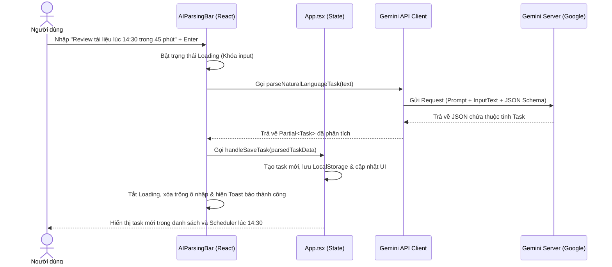

# Kế hoạch Thực hiện Sprint 1 - Chức năng 1: Trợ lý Thiết lập Nhanh bằng AI (AI Auto-Triage Agent)

Tài liệu này chi tiết ý tưởng thiết kế UI/UX, Prompt Engineering, và luồng dữ liệu cho chức năng nhập liệu tác vụ bằng ngôn ngữ tự nhiên thông qua Google Gemini API.

---

## 1. Thiết kế Giao diện (UI/UX Mockup)

Thêm một thanh nhập liệu thông minh (AI Command Bar) nổi bật tại đỉnh của danh sách nhiệm vụ trên Dashboard.

```
+---------------------------------------------------------------------------------+
|  ✨ Trợ lý Phân loại AI                                                          |
|  [ Nhập công việc... (Ví dụ: Họp nhóm lúc 14:00 trong 30 phút)               ] [Gửi] |
|  💡 Gợi ý: "Học tiếng Anh giao tiếp" | "Xem tài liệu dự án trong 45 phút lúc 15:30"   |
+---------------------------------------------------------------------------------+
```

### Chi tiết hành vi UI:
*   **Trạng thái bình thường:** Ô nhập liệu hiển thị placeholder hướng dẫn kèm icon lấp lánh (Sparkles) đại diện cho AI.
*   **Trạng thái đang xử lý (Loading):** Khóa ô nhập liệu, hiển thị hiệu ứng xoay tròn (spinner) và dòng thông báo nhẹ *"Gemini đang phân loại..."*.
*   **Trạng thái thành công:** Xóa trống ô nhập, tự động tạo task xuất hiện trong danh sách kèm hiệu ứng chuyển động mượt mà và hiển thị Toast thông báo thành công: *"Đã thêm task [Tên task] bằng AI thành công!"*.
*   **Trạng thái lỗi:** Hiển thị thông báo đỏ dưới thanh nhập liệu: *"Không phân tích được câu lệnh. Vui lòng nhập rõ hơn!"*.

---

## 2. Luồng Xử lý Dữ liệu (Sequence Diagram)



---

## 3. Thiết kế Prompt & Cấu trúc Đầu ra (Structured Outputs)

Sử dụng SDK `@google/genai` với tính năng `Structured Outputs` nhằm bắt buộc AI trả về kết quả định dạng JSON khớp 100% với kiểu dữ liệu `Task` trong ứng dụng.

### Biến môi trường
Sử dụng biến `import.meta.env.VITE_GEMINI_API_KEY`.

### Prompt thiết lập (System Instruction / User Context)
```typescript
const systemPrompt = `
Bạn là trợ lý ảo phân loại công việc thông minh cho ứng dụng FocusFlow.
Nhiệm vụ của bạn là phân tích câu lệnh tiếng Việt của người dùng và chuyển đổi thành thông tin chi tiết của công việc.

Các quy tắc phân tích:
1. Xác định đúng tiêu đề (title) ngắn gọn, súc tích.
2. Trích xuất thời lượng dự kiến (estimated_min) nếu được nhắc đến (ví dụ "trong 45 phút" -> 45). Nếu không nhắc đến, hãy tự động ước lượng dựa trên tính chất công việc hoặc mặc định là 25 phút.
3. Xác định khung giờ bắt đầu (scheduled_at) định dạng "HH:MM" nếu người dùng ghi thời gian (ví dụ "lúc 14:30", "chạy bộ lúc 5h chiều" -> "17:00"). Nếu không nhắc đến giờ cụ thể, hãy để trống trường này.
4. Phân loại danh mục (category):
   - "Học tập": cho các việc học, nghiên cứu, đọc sách, ngoại ngữ...
   - "Làm việc": cho các việc code, họp hành, báo cáo, viết tài liệu, công việc văn phòng...
   - "Admin": cho các việc giấy tờ, dọn dẹp, check mail, việc vặt cá nhân...
5. Xác định ma trận Eisenhower (eisenhower_q):
   - Q1: Việc khẩn & quan trọng (họp gấp, deadline hôm nay, xử lý lỗi hệ thống...)
   - Q2: Việc quan trọng nhưng không khẩn (học tập ôn thi, đọc sách, lập kế hoạch, deep work...)
   - Q3: Việc khẩn nhưng ít quan trọng (họp định kỳ, check mail hàng ngày, gọi điện hỗ trợ...)
   - Q4: Việc ít quan trọng & không khẩn (lướt mạng xã hội, giải trí nhẹ...)
6. Xác định mức năng lượng tiêu tốn (energy_level):
   - HIGH: Đòi hỏi tập trung cao độ, sáng tạo hoặc động não nhiều (viết code khó, học kỹ năng mới).
   - MEDIUM: Công việc trung bình, thao tác quen thuộc (họp, viết email, sửa lỗi nhỏ).
   - LOW: Công việc thủ tục, lặp đi lặp lại hoặc việc cơ bắp (dọn dẹp drive, lọc mail).
7. Hạn ngày (due_date) mặc định luôn là ngày hôm nay theo định dạng YYYY-MM-DD.
`;
```

### JSON Schema định nghĩa kiểu trả về
```typescript
const responseSchema = {
  type: "object",
  properties: {
    title: { type: "string", description: "Tên ngắn gọn của công việc" },
    description: { type: "string", description: "Mô tả chi tiết bổ sung (nếu có)" },
    category: { type: "string", enum: ["Làm việc", "Học tập", "Admin"] },
    eisenhower_q: { type: "string", enum: ["Q1", "Q2", "Q3", "Q4"] },
    energy_level: { type: "string", enum: ["HIGH", "MEDIUM", "LOW"] },
    estimated_min: { type: "number", description: "Thời lượng (phút)" },
    scheduled_at: { type: "string", description: "Giờ bắt đầu dạng HH:MM" },
    due_date: { type: "string", description: "Hạn ngày dạng YYYY-MM-DD" }
  },
  required: ["title", "category", "eisenhower_q", "energy_level", "estimated_min", "due_date"]
};
```

---

## 4. Kế hoạch Hiện thực hóa (Các Bước Code)

- [ ] **Bước 1:** Khởi tạo tệp helper gọi API Gemini `src/utils/gemini.ts` chứa hàm `parseNaturalLanguageTask`.
- [ ] **Bước 2:** Xây dựng component giao diện nhập liệu nhanh `src/components/AIParsingBar.tsx`.
- [ ] **Bước 3:** Tích hợp `AIParsingBar` vào trang Dashboard trong `src/App.tsx`, kết nối hàm callback để lưu task sau khi AI phân tích thành công.
- [ ] **Bước 4:** Viết unit test thủ công bằng cách nhập các kịch bản thử nghiệm:
    *   *Test case 1 (Đầy đủ):* *"Viết báo cáo doanh thu quý 2 lúc 14:00 trong 60 phút"* $\rightarrow$ Kiểm tra xem có gán đúng giờ 14:00, thời lượng 60p, danh mục Làm việc, Q1 hoặc Q2, năng lượng HIGH/MEDIUM.
    *   *Test case 2 (Tối giản):* *"Đọc sách triết học"* $\rightarrow$ Kiểm tra các giá trị mặc định (Học tập, 25p, Q2, HIGH).
    *   *Test case 3 (Giờ chiều/sáng dạng văn bản):* *"Chạy bộ công viên lúc 5h chiều"* $\rightarrow$ Xem AI có chuyển sang `17:00` hay không.
