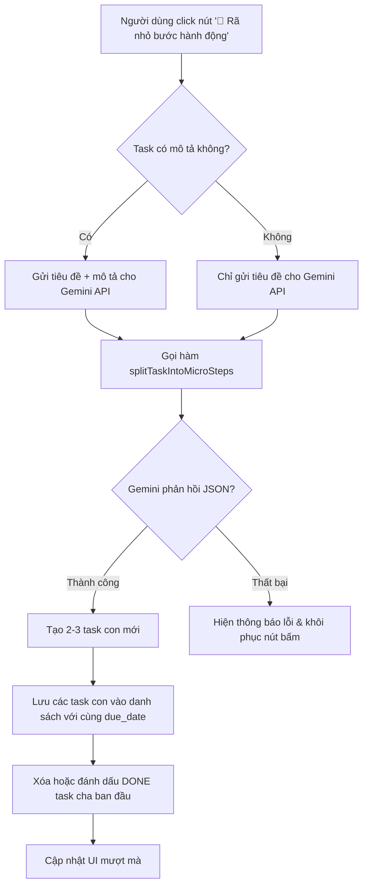

# Tài liệu Đặc tả Chức năng PB-F2: Hệ thống Giới hạn Trì hoãn & Đổi góc nhìn (Anti-Doom-Pile)

Tài liệu này đặc tả chi tiết cấu trúc dữ liệu, luồng nghiệp vụ, giao diện UI/UX và thiết kế Prompt dành cho tính năng cảnh báo và chia nhỏ công việc trì hoãn (PB-F2).

---

## 1. Mục tiêu & Nguyên lý (Psychological Principle)
*   **Vấn đề:** Khi một công việc quá lớn hoặc mơ hồ, người dùng có xu hướng dời lịch ngày này qua ngày khác (Doom Pile). Mỗi lần dời lịch sẽ tăng cảm giác tội lỗi và khiến họ càng khó bắt đầu.
*   **Giải pháp:** 
    1.  *Nhận diện:* Tự động đếm số lần đổi hạn (`postpone_count`) và cảnh báo trực quan khi vượt ngưỡng ( $\ge 3$ lần).
    2.  *Hành động:* Sử dụng AI để "rã nhỏ" (Micro-steps) task đó thành 2-3 tác vụ siêu ngắn ($\le 15$ phút) với năng lượng thấp. Việc này giúp giảm rào cản tâm lý ("Friction") tối đa để người dùng có thể thực hiện bước đầu tiên ngay lập tức.

---

## 2. Thay đổi Cấu trúc Dữ liệu (Data Model Changes)

Cần mở rộng interface `Task` trong tệp `src/types.ts` để theo dõi lịch sử hoãn:

```typescript
export interface Task {
  id: string;
  title: string;
  description?: string;
  status: TaskStatus;
  category: TaskCategory;
  eisenhower_q: EisenhowerQuadrant;
  energy_level: EnergyLevel;
  estimated_min: number;
  actual_min?: number;
  scheduled_at?: string;
  completed_at?: string;
  due_date?: string;
  
  // Trường mới thêm vào
  postpone_count?: number; // Số lần task bị dời due_date sang ngày khác
}
```

---

## 3. Quy tắc Đếm Trì hoãn (Tracking Logic)

Hệ thống sẽ tăng `postpone_count` lên `1` trong các trường hợp sau:
1.  **Đóng ngày EOD (ClosureModal):** Khi người dùng thực hiện đóng ngày và chọn dời các task chưa hoàn thành sang ngày hôm sau.
2.  **Sửa tay trong TaskFormModal:** Khi người dùng thay đổi trường `due_date` của một task sang một ngày xa hơn ngày cũ.
    *   *Logic code:* So sánh `newDueDate > oldDueDate`. Nếu đúng, tăng `postpone_count = (postpone_count || 0) + 1`.

---

## 4. Thiết kế Giao diện (UI/UX Design)

### 4.1. Nhãn Cảnh báo trên Task Card
Đối với bất kỳ task nào có `postpone_count >= 3` và trạng thái `status !== 'DONE'`:
*   Hiển thị một nhãn cảnh báo nhỏ màu cam bên dưới tiêu đề task: `⚠️ Bị dời hạn quá 3 lần`.
*   Hiển thị nút bấm hành động nhanh: `🧩 Rã nhỏ bước hành động`.

```
+-------------------------------------------------------------------------+
| [ ] 💼 Viết báo cáo doanh thu tài chính quý 2          ⏱️ 120 phút      |
|     ⚠️ Bị dời hạn quá 3 lần  [🧩 Rã nhỏ bước hành động]                  |
|     [Q1: Khẩn & Quan trọng] [⚡ HIGH (Deep Work)]                      |
+-------------------------------------------------------------------------+
```

### 4.2. Trạng thái Loading khi Rã nhỏ
*   Khi click nút `🧩 Rã nhỏ bước hành động`, nút này sẽ chuyển sang trạng thái Disable kèm theo biểu tượng loading: `⏳ Đang rã nhỏ...`.
*   Chạy hiệu ứng mờ nhạt (fade-out) nhẹ trên thẻ task cũ trước khi bị thay thế bằng các task con mới.

---

## 5. Luồng Nghiệp vụ Rã nhỏ bằng AI (Business Flow)



### Chi tiết cách thay thế Task:
Khi rã nhỏ thành công task cha $T_0$ thành các task con $t_1, t_2$:
*   $T_0$ sẽ bị loại bỏ khỏi danh sách hoạt động (hoặc đánh dấu trạng thái đặc biệt).
*   Các task con $t_i$ được sinh ra sẽ kế thừa:
    *   `due_date` bằng `due_date` của $T_0$.
    *   `category` bằng `category` của $T_0$.
    *   `eisenhower_q` kế thừa hoặc tự động gán ở mức thấp hơn/bằng.
    *   `estimated_min` và `energy_level` do AI trả về (tổng thời gian các task con thường nhỏ hơn hoặc bằng task cha).

---

## 6. Thiết kế Prompt và Schema cho API Gemini

Thêm hàm sau vào `src/utils/gemini.ts` để tương tác với Gemini:

### Prompt
```typescript
const promptText = `
Bạn là chuyên gia tư vấn năng suất chống trì hoãn.
Nhiệm vụ của bạn là rã nhỏ một công việc lớn và gây nản lòng thành 2 đến 3 bước hành động cực kỳ dễ bắt đầu (micro-steps).

Quy tắc rã nhỏ:
1. Mỗi bước con phải vô cùng cụ thể, rõ ràng và có thể hoàn thành trong 5 đến 15 phút (estimated_min).
2. Mức năng lượng (energy_level) nên ở mức LOW hoặc MEDIUM để giảm sức cản tinh thần cho người dùng.
3. Các bước phải xếp theo thứ tự thực hiện từ trước đến sau.
4. Tên bước con nên chứa động từ hành động trực tiếp (ví dụ: "Mở tài liệu báo cáo", "Lấy 1 cốc nước ấm", "Gõ 3 dòng mở bài").

Công việc cần rã nhỏ: "${parentTitle}"
Mô tả công việc: "${parentDescription || 'Không có mô tả'}"
`;
```

### JSON Schema phản hồi
```typescript
const responseSchema = {
  type: "array",
  description: "Danh sách 2 đến 3 bước con hành động siêu nhỏ",
  items: {
    type: "object",
    properties: {
      title: { type: "string", description: "Tên hành động con cụ thể" },
      estimated_min: { type: "integer", description: "Thời lượng (từ 5 đến 15 phút)" },
      energy_level: { type: "string", enum: ["HIGH", "MEDIUM", "LOW"], description: "Mức năng lượng tiêu tốn" }
    },
    required: ["title", "estimated_min", "energy_level"]
  }
};
```

---

## 7. Kế hoạch Hiện thực hóa (Các Bước Code)

- [ ] **Bước 1:** Cập nhật file `src/types.ts` để hỗ trợ trường `postpone_count`.
- [ ] **Bước 2:** Viết hàm `splitTaskIntoMicroSteps` trong tệp `src/utils/gemini.ts`.
- [ ] **Bước 3:** Cấu trúc lại logic tăng `postpone_count` tại:
    *   Hàm đóng ngày `handleConfirmClosure` trong `src/App.tsx`.
    *   Hàm sửa task `handleSaveTask` trong `src/App.tsx`.
- [ ] **Bước 4:** Cập nhật giao diện thẻ công việc trong `src/components/TaskList.tsx` để hiển thị nhãn trì hoãn và nút rã nhỏ.
- [ ] **Bước 5:** Tích hợp logic xử lý sự kiện click "Rã nhỏ" tại `TaskList.tsx` / `App.tsx` để thay thế task cũ bằng task con mới.
- [ ] **Bước 6:** Kiểm tra thủ công: Đổi due_date một task 3 lần, kiểm tra nhãn hiện ra, click rã nhỏ và xem kết quả.
