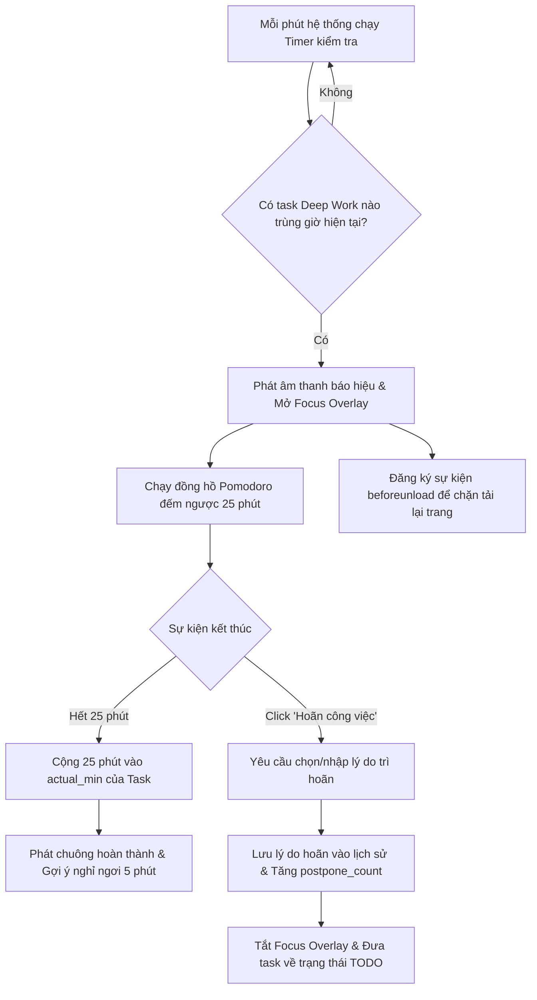

# Tài liệu Đặc tả Kỹ thuật Chức năng PB-F6: Khóa Tập trung dựa trên Lịch trình (Schedule-based Focus Mode)

Tài liệu này đặc tả chi tiết về cách hoạt động, giao diện UI/UX và các bước phát triển kỹ thuật cho tính năng Cưỡng chế tập trung (Focus Lock) trong Sprint 2 của dự án FocusFlow.

---

## 1. Mục tiêu & Nguyên lý (Psychological Principle)
*   **Vấn đề:** Khi bắt đầu làm việc sâu (Deep Work), người dùng rất dễ bị phân tâm bởi các tác vụ lướt web, kiểm tra thông báo hoặc các việc phụ vặt khác trong ứng dụng.
*   **Giải pháp:** 
    1.  *Kích hoạt thụ động:* Tự động phát hiện khi đến giờ hẹn của một task quan trọng và khóa toàn màn hình làm việc trong ứng dụng (In-app Focus Lock).
    2.  *Pomodoro & Micro-steps:* Tích hợp đếm ngược 25 phút kèm danh sách việc con (micro-steps) trực quan để người dùng tập trung giải quyết từng việc nhỏ.
    3.  *Tăng Friction khi thoát:* Yêu cầu nhập lý do trì hoãn cụ thể nếu muốn thoát sớm, kích hoạt cơ chế tự phản chiếu bản thân để hạn chế bỏ cuộc nửa chừng.

---

## 2. Tiêu chí xác định tác vụ "Deep Work"
Hệ thống sẽ quét định kỳ mỗi phút và chỉ kích hoạt chế độ tập trung cho các task thỏa mãn toàn bộ các điều kiện sau:
*   `due_date`: Bằng ngày hôm nay.
*   `scheduled_at`: Trùng khớp với giờ hiện tại của hệ thống (Ví dụ: `09:30`).
*   `status`: Khác `DONE` (chưa hoàn thành).
*   `category`: Thuộc nhóm `Làm việc` hoặc `Học tập` (Không kích hoạt cho nhóm `Admin` hoặc các nhóm phụ).
*   `eisenhower_q`: Thuộc nhóm `Q1` (Khẩn cấp & Quan trọng) hoặc `Q2` (Không khẩn cấp nhưng Quan trọng).
*   `energy_level`: Yêu cầu mức năng lượng `HIGH` hoặc `MEDIUM`.

---

## 3. Thay đổi Cấu trúc Dữ liệu (Data Model Changes)
Cần mở rộng thêm trường dữ liệu lưu trữ lý do trì hoãn tại `src/types.ts`:

```typescript
export interface Task {
  // ... các trường cũ ...
  postpone_reasons?: string[]; // Danh sách lý do người dùng nhập khi thoát khỏi chế độ tập trung
}
```

---

## 4. Thiết kế Giao diện Focus Overlay (UI/UX)
Lớp phủ tập trung sẽ là một component riêng biệt (`FocusOverlay.tsx`) che phủ toàn bộ trang web:
*   **Aesthetics:** Phong cách tối giản, nền tối sâu (Deep Dark Mode), sử dụng hiệu ứng Blur Glassmorphism (`backdrop-blur-md`) đè lên giao diện dashboard phía sau.
*   **Nội dung hiển thị:**
    *   Tiêu đề công việc hiện tại (Cỡ chữ lớn, rõ ràng).
    *   Danh mục công việc con (Micro-steps) dưới dạng checkbox để người dùng tích chọn trực tiếp.
    *   Đồng hồ đếm ngược Pomodoro (`25:00`) lớn ở trung tâm.
    *   Nút Tạm dừng/Tiếp tục (`Play/Pause`) và nút Tắt âm thanh nền.
*   **Bật âm thanh nền tự nhiên (Ambient Sound):** Tích hợp trình phát âm thanh White Noise hoặc Rain Sound nhẹ nhàng bằng Web Audio API để lọc tiếng ồn ngoại cảnh.
*   **Nút bấm Hoãn/Thoát:** Nằm kín đáo ở góc dưới. Khi bấm vào sẽ hiển thị một danh sách lựa chọn lý do:
    *   `[ ] Kiệt sức / Mệt mỏi`
    *   `[ ] Có việc đột xuất khẩn cấp`
    *   `[ ] Bị phân tâm / Mất tập trung`
    *   `[ ] Lý do khác (Tự nhập...)`

---

## 5. Luồng Nghiệp vụ Hệ thống



---

## 6. Giải pháp Kỹ thuật Chi tiết

### 6.1. Ngăn chặn thoát trang ngẫu nhiên (Vô hiệu hóa F5 / Đóng Tab)
Sử dụng sự kiện `beforeunload` của trình duyệt:
```typescript
import { useEffect } from 'react';

export function useFocusLock(isActive: boolean) {
  useEffect(() => {
    if (!isActive) return;

    const handleBeforeUnload = (e: BeforeUnloadEvent) => {
      e.preventDefault();
      e.returnValue = 'Hệ thống đang khóa tập trung. Bạn có chắc chắn muốn thoát và làm gián đoạn công việc?';
    };

    window.addEventListener('beforeunload', handleBeforeUnload);
    return () => {
      window.removeEventListener('beforeunload', handleBeforeUnload);
    };
  }, [isActive]);
}
```

### 6.2. Phát âm thanh báo hiệu qua Web Audio API (Tránh file MP3 bị lỗi link)
```typescript
export function playFocusAlertSound() {
  const ctx = new (window.AudioContext || (window as any).webkitAudioContext)();
  const osc = ctx.createOscillator();
  const gain = ctx.createGain();
  
  osc.type = 'sine';
  osc.frequency.setValueAtTime(520, ctx.currentTime); // Âm báo nốt C5
  
  gain.gain.setValueAtTime(0.3, ctx.currentTime);
  gain.gain.exponentialRampToValueAtTime(0.01, ctx.currentTime + 1.2);
  
  osc.connect(gain);
  gain.connect(ctx.destination);
  
  osc.start();
  osc.stop(ctx.currentTime + 1.2);
}
```

---

## 7. Kế hoạch Hiện thực hóa (Các Bước Code)

- [ ] **Bước 1:** Cập nhật `src/types.ts` để bổ sung trường `postpone_reasons?: string[]` trong `Task`.
- [ ] **Bước 2:** Xây dựng component `src/components/FocusOverlay.tsx` chứa Pomodoro timer, danh sách các bước con và âm thanh nền alpha.
- [ ] **Bước 6:** Tạo hook `useFocusLock` và hàm `playFocusAlertSound` trong thư mục utility.
- [ ] **Bước 4:** Viết timer quét định kỳ tại `src/App.tsx` kiểm tra thời gian hiện tại khớp với lịch hẹn tác vụ Deep Work.
- [ ] **Bước 5:** Xử lý sự kiện hoàn tất Pomodoro (cộng thời gian thực tế `actual_min`) hoặc hoãn task (ghi nhận lý do và tăng `postpone_count`).
- [ ] **Bước 6:** Tiến hành chạy thử nghiệm liên kết và kiểm tra sự ổn định của giao diện khóa tập trung Pomodoro.
